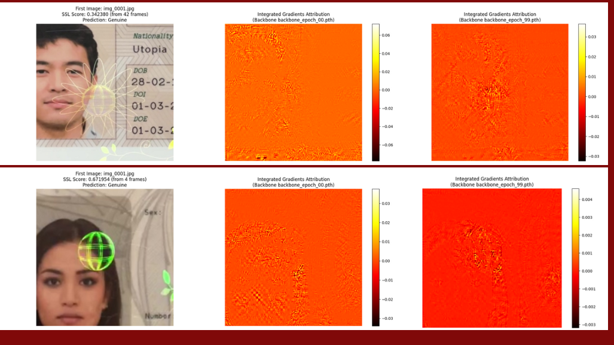
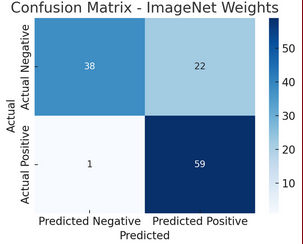
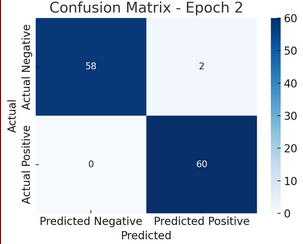
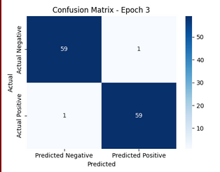
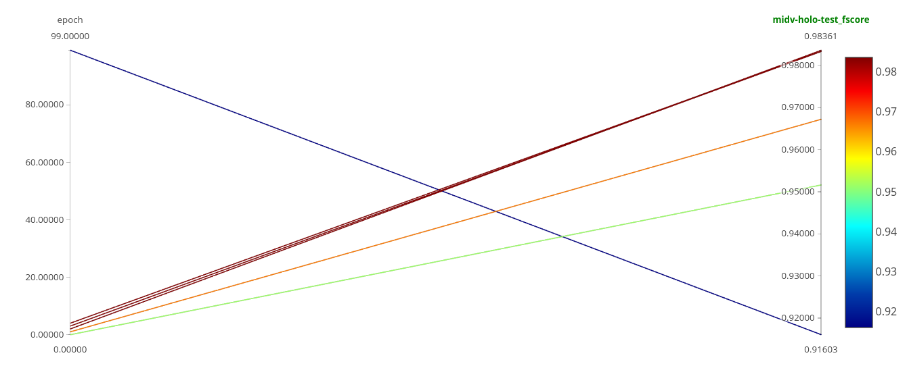
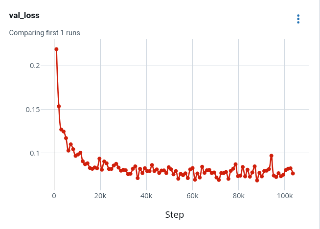

# Document Fraud Detection

A comprehensive framework for document fraud detection using self-supervised learning models and explainable AI techniques. This project implements various approaches including baseline ImageNet models, SSL pretrained models, and integrated gradients for model interpretation.

## Overview

This repository contains the implementation for document fraud detection research, featuring:

- **Self-Supervised Learning (SSL) models** for document authenticity verification
- **Multiple decision strategies** including frame-by-frame and cumulative analysis
- **Explainable AI integration** using Integrated Gradients for model interpretability
- **Comprehensive evaluation framework** with MLflow experiment tracking
- **Calibration utilities** for threshold optimization


### Core Functionality
- **SSL Model Training**: Train self-supervised learning models on document datasets
- **Fraud Detection**: Binary classification for document authenticity
- **Decision Strategies**: Multiple approaches for video/sequence-based decisions
- **Threshold Calibration**: Automatic threshold optimization for optimal performance

### Explainability
- **Integrated Gradients**: Generate attribution maps for model predictions
- **Visualization Tools**: Plot and analyze model attention patterns
- **Frame-by-frame Analysis**: Understand decision processes at each step

### Evaluation
- **Comprehensive Testing**: Test models across multiple datasets
- **Baseline Comparisons**: Compare against ImageNet pretrained models
- **MLflow Integration**: Track experiments and metrics automatically
- **Multiple Checkpoints**: Evaluate different model versions

## Installation

1. **Set up the environment**:
   ```bash
   # Create virtual environment (recommended)
   python -m venv venv
   source venv/bin/activate  # On Windows: venv\Scripts\activate
   
   # Install dependencies
   pip install torch torchvision lightning
   pip install hydra-core omegaconf
   pip install mlflow
   pip install captum  # For Integrated Gradients
   pip install matplotlib pillow
   ```

## Usage


### Baseline Evaluation

Test ImageNet pretrained models without additional training:

```bash
python test_imagenet_baseline.py

### train_mobilevit.sh

This script provides a complete training and evaluation pipeline for MobileViT models:


```bash
# Usage
./jobs/wsl/train_mobilevit.sh
```

**What it does:**
- Executes a full end-to-end pipeline: training → calibration → testing
- Trains a MobileViT-S model using SSL approach on k0 data split
- Performs calibration and testing with two decision strategies (allvideo and cumulative)
- Tests across all data splits (k0, k1, k2, k3, k4) for comprehensive evaluation

**Pipeline steps:**
1. **Training**: Trains MobileViT-S model on k0 split
2. **AllVideo Strategy**: Calibrates thresholds and tests using allvideo decision method
3. **Cumulative Strategy**: Calibrates thresholds and tests using cumulative decision method

**Key parameters:**
- `--config-name=wsl`: Uses WSL-specific configuration
- `+experiment=wsl/mobilevit_s`: Loads MobileViT-S experiment settings
- `paths.split_name=k0`: Training on k0 split, testing on all splits (k0-k4)
- `decision=allvideo/cumulative`: Two different decision strategies for comparison


### test_multiple.sh

This script automates the calibration + evaluation of multiple model checkpoints from a training run:

```bash
# Usage
./jobs/test_multiple.sh
```

**What it does:**
- Runs `test_multiple_checkpoints.py` with predefined configurations
- Uses WSL experiment configuration with MobileViT-S model
- Tests on k0 data split with cumulative decision strategy
- Evaluates all checkpoints from a specific MLflow run directory

**Key parameters:**
- `--config-name=wsl`: Uses WSL-specific configuration
- `+experiment=wsl/mobilevit_s`: Loads MobileViT-S experiment settings
- `paths.split_name=k0`: Tests on k0 data split
- `decision=cumulative`: Uses cumulative decision strategy
- `+checkpoint_dir=...`: Path to directory containing multiple checkpoints

### integrated_gradients.sh

This script runs explainability analysis using Integrated Gradients on document images:

```bash
# Usage
./jobs/integrated_gradients.sh
```

**What it does:**
- Runs `integrated_gradients.py` with predefined configurations
- Analyzes images from a specific directory using a trained model
- Generates attribution maps showing which pixels influence the fraud detection decision
- Uses a specific checkpoint for model weights

**Key parameters:**
- `--config-name=wsl`: Uses WSL-specific configuration
- `+experiment=wsl/mobilevit_s`: Loads MobileViT-S experiment settings
- `paths.split_name=k0`: Uses k0 data split configuration
- `decision=cumulative`: Uses cumulative decision strategy
- `+image_dir=...`: Directory containing images to analyze
- `+checkpoint_path=...`: Specific model checkpoint to load


### Data Preprocessing Scripts

The project includes specialized scripts for document preprocessing:

#### Homography and ROI Cropping - `data/generate_midv-holo.py`

This script performs geometric correction and region of interest extraction:

**Functionality:**
- **Homography correction**: Applies perspective transformation to rectify documents using template quad coordinates from markup files
- **ROI cropping**: Extracts specific regions of interest from rectified documents
- **Batch processing**: Processes both original and fraud documents in parallel

**Key features:**
- Uses perspective transformation (`cv2.getPerspectiveTransform`) to correct document orientation
- Extracts ROI coordinates `[[141, 224], [498, 557]]` for consistent document regions
- Generates two outputs:
  - `/rectified/`: Full perspective-corrected documents (1123×709 pixels)
  - `/crop_ovds/`: ROI-cropped versions for focused analysis
- Processes both origins and fraud datasets with parallel execution

**Usage:**
```bash
cd data/
python generate_midv-holo.py
```

#### Light Normalization - `seuillage_tous_fichiers.py`

This script removes intense lighting artifacts from document images:

**Functionality:**
- **Overexposure detection**: Identifies regions with pixel values ≥ 240 (intense light)
- **Temporal correction**: Uses neighboring frames to reconstruct overexposed areas
- **Morphological processing**: Applies dilation and erosion to refine detection masks

**Key features:**
- Detects overexposed regions using grayscale thresholding
- Corrects artifacts by averaging neighboring frame pixels in overexposed areas
- Applies morphological operations (kernel size 5×5) to improve mask quality
- Preserves original image quality in non-overexposed regions
- Batch processes entire folder hierarchies

**Usage:**
```bash
python seuillage_tous_fichiers.py
```

**Configuration:**
```python
# Input and output directories
root_input_folder = "/path/to/input/images/"
root_output_folder = "/path/to/output/corrected/"

# Processing parameters
kernel_size = 5  # Morphological operations kernel
threshold = 240  # Overexposure detection threshold
```

### Dataset Structure

After preprocessing, the expected structure is:

```
data/midv-holo/
├── images/           # Original images
├── rectified/        # Homography-corrected documents
├── crop_ovds/        # ROI-cropped regions
├── output_seuillages/# Light-normalized images
└── markup/           # Template quad annotations
```

## Model Architectures

- **SSL Models**: Self-supervised learning approaches
- **ImageNet Baselines**: Pretrained model comparisons


## Experiment Tracking

The project integrates with MLflow for comprehensive experiment tracking:

- **Automatic logging**: Metrics, parameters, and artifacts
- **Model comparison**: Compare different architectures and hyperparameters
- **Visualization**: Built-in plots and metric visualization
- **Reproducibility**: Complete experiment state tracking

Access MLflow UI:
```bash
mlflow ui
```

## Explainability Features

### Integrated Gradients

Generate attribution maps to understand model decisions:

```bash
python integrated_gradients.py \
    image_dir=/path/to/images \
    checkpoint_path=/path/to/checkpoint.ckpt \
    target_class=0
```

Features:
- **Attribution maps**: Pixel-level importance visualization
- **Convergence analysis**: Quality metrics for attributions
- **Batch processing**: Handle multiple images
- **Configurable targets**: Analyze different output classes


## Results

This section presents key experimental results demonstrating the effectiveness of the document fraud detection framework.

### Performance Metrics





### Model Comparison



### Training Progress


The results demonstrate the framework's ability to effectively detect document fraud across different model architectures and decision strategies. Key findings include improved performance through SSL pretraining and the effectiveness of different decision approaches for various fraud types.

## Contact

yacine.flici@etu.u-paris.fr
---

